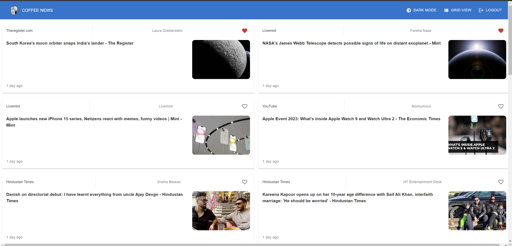
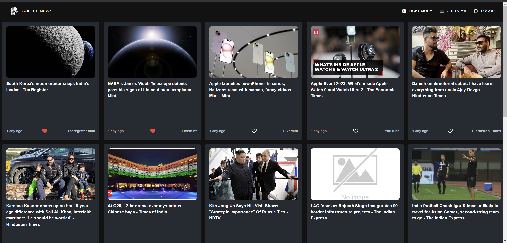
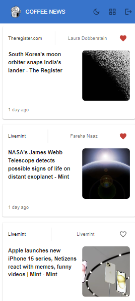

#  News App

**Description:** This is a React-based web app that allows users to access and personalize news articles. It integrates Firebase for user authentication, an open-source news API for fetching articles, and provides features like grid view, news detail view, favoriting articles, state management using Redux, offline support, and responsive UI/UX design.

## Features

1. **User Registration and Login**
   - Users can create accounts and log in using Firebase for authentication.

2. **News API Integration**
   - Fetches the latest news articles from an open-source news API (e.g., NewsAPI).
   - Displays articles in a list view for the Flutter app and two columns of list view for the web app.

3. **Grid View**
   - Includes a toggle button to switch between list and grid view for news articles.

4. **News Detail View**
   - When users tap on a news article, it opens a full-screen detailed view.
   - Shows the title, description, image, and a link to the full article.
   - Utilizes an in-app web view for displaying the full article content (for the Flutter app).

5. **Favorite Articles**
   - Users can mark articles as favorites.
   - Preferences are stored in Firebase for persistence.
   - Favoriting can be done via a heart icon on list items or the details view.

6. **State Management**
   - Utilizes Redux for state management.

7. **Offline Support**
   - Implements caching mechanisms to allow users to read previously fetched news articles even when offline.

8. **Design and UI/UX**
   - Pay attention to app design to create a user-friendly interface, provides a dark mode too.

9. **Responsive**
   - The app is responsive to different screen sizes and provides a smooth user experience.

## Setup

1. **Clone the repository:**

   ```sh
   git clone https://github.com/ashvin_ck/news-app.git
   cd news-app
   ```

2. **Install dependencies**:

    ```sh
    npm install
    ```

3. **Configure Firebase**:

    1. Create a Firebase project in the Firebase Console.
    2. Set up Firebase Authentication and Firestore for storing user data and favorites.
    3. Update Firebase configuration in the app (usually in src/firebase.js).
    4. Sign up for an API key from NewsAPI or your chosen news API source.
    5. Update the API key in your app's configuration.
    6. Start the development server:
     
     ```sh
     npm start
     ```


## Usage

- Register and log in to your account using the provided authentication system.
- Browse and read the latest news articles.
- Toggle between list and grid view.
- Click on a news article to view its details.
- Favorite articles by clicking the heart icon.
- Access your favorite articles from the favorites section.
- Enjoy a responsive and user-friendly interface.
- Contributing
- If you would like to contribute to this project, please follow these steps:

## Fork the repository.

Create a new branch for your feature: git checkout -b feature-name
Make your changes and commit them: git commit -m 'Add feature-name'
Push to the branch: git push origin feature-name
Create a pull request.

## License
This project is licensed under the MIT License.

## Preview 




